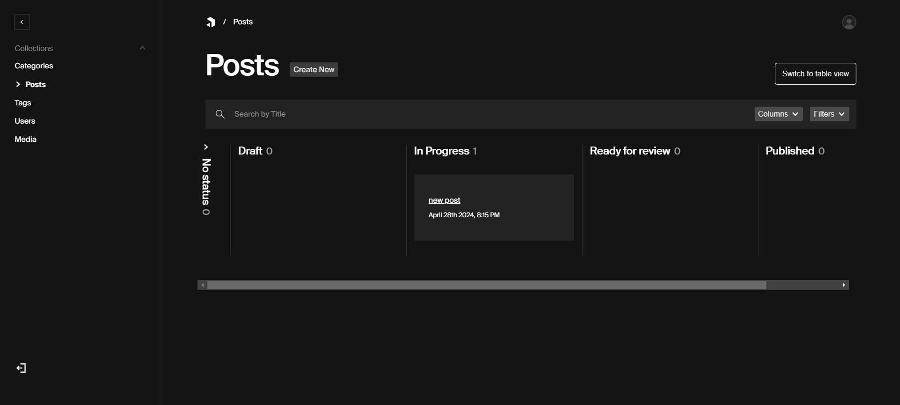

# Payload kanban plugin

> **Note**
> This plugin is currently under active development and still in an early stage.
> Check the [roadmap](#roadmap) below in this readme for more details / upcoming features.

<picture>
  <source media="(prefers-color-scheme: dark)" src="./preview-dark.png" />
  <source media="(prefers-color-scheme: light)" src="./preview-light.png" />
  
</picture>

## Installation

The most recent version of payload-kanban-board currently only supports Payload 3.0 and up.

```shell
$ yarn add payload-kanban-board
$ npm i payload-kanban-board
```

To use it on payload version < 3.0

```shell
$ yarn add payload-kanban-board@1.0.3
$ npm i payload-kanban-board@1.0.3
```

## Basic usage

```typescript
import { payloadKanbanBoard } from 'payload-kanban-board';

const config = buildConfig({
  collections: [ ... ],
  plugins: [
    payloadKanbanBoard({
      collections: {
        posts: {
          enabled: true,
          config: {
            statuses: [
              {
                value: 'draft',
                label: 'Draft',
              },
              { value: 'in-progress', label: 'In Progress' },
              {
                value: 'ready-for-review',
                label: 'Ready for review',
                dropValidation: ({ user, data }) => {
                  return { dropAble: false }
                  //<dropValidation key is optional>
                },
              },
              { value: 'published', label: 'Published' },
            ],

            defaultStatus: 'todo',
            hideNoStatusColumn: true,
          },
        },
      },
    })
  ],
});
```

To use it on payload version < 3.0

```typescript
import { payloadKanbanBoard } from 'payload-kanban-board';

const config = buildConfig({
  collections: [ ... ],
  plugins: [
    payloadKanbanBoard({
      'my-collection-slug': {
        statuses: [
          {value: 'draft', label: 'Draft', dropValidation:({user,data})=>return true}, //<dropValidation key is optional>
          {value: 'in-progress', label: 'In Progress'},
          {value: 'ready-for-review', label: 'Ready for review'},
          {value: 'published', label: 'Published'},
        ],
        defaultStatus: 'draft',
        hideNoStatusColumn: false,
        fieldAccess:{
          // <These fields are optional>
          update:() => true,
          create:() => false,
          read:() => false,
        },
        fieldAdmin: {
          // <These fields are optional>
          hidden:true
          // Any admin props for a normal field in payload cms
        },

      }
    })
  ],
});
```

## Differences with the draft/publish system of Payload.

The kanban plugin introduces a new field called `kanbanStatus`. This field does not interact with the draft/publish
system of Payload.

You can "integrate" the kanban status with the draft/publish system of Payload yourself by
using [Payloads hooks](https://payloadcms.com/docs/hooks/overview).

For example: Automatically publish the document when the `kanbanStatus` has been changed to `published`.

<h2 id="roadmap">Roadmap</h2>
Upcoming Features / Ideas. Have a suggestion for the plugin? Feel free to open an issue or contribute!

- [x] Payload 2.0 support
- [x] Payload 3.0 support
- [ ] Customize card properties (currently displays `title` and `createdAt`)
- [ ] Edit relationships directly from the card (e.g., assigning users to a document)
- [x] Toggleable column for posts without a kanban status (Currently, documents lacking `kanbanStatus` aren't
      visible on the board)
- [ ] Lazy loading of column contents when scrolling (Currently, board only shows `defaultLimit` amount of cards)
- [x] Validation for changing statuses
- [ ] Allowed transitions between statuses
- [ ] Integration with the draft/publish system of Payload (?)
